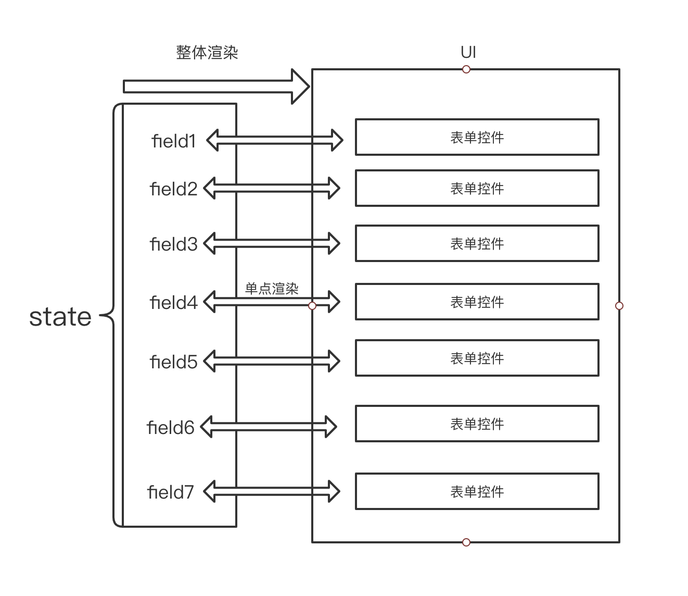

# mobx-fast-form

`mobx` 轻度封装的高性能轻量级 `React` 表单组件，`Typescript` 实现

[demo](./src/demo/index.tsx)

#### 解决的问题

解决大型表单在输入时的性能问题

#### 高性能原理

-   普通 React 表单组件的原理：`UI = f(state)`，这里的 `state` 即表单数据，每次表单控件输入时，改变 `state` 的值，再重新渲染整个表单，得到最终渲染出来的 `UI`。当表单中包含的 `DOM` 元素增多时，即使只是一个输入框的更改，都会使得表单中所有的元素进行重渲染，性能会随着元素增加而降低。大型表单的性能较差，就是这个原因，而大多第三方表单组件使用的都是类似方案。

-   本组件在 `mobx` 的基础上轻度封装，利用 `mobx` 可单点精确更新 UI 的特性，提高表单性能

    

#### 组件

-   [Form](./src/form/core/Form.tsx)

-   [FormProvider](./src/form/core/FormProvider.tsx)

-   [Field](./src/form/core/Field.tsx)

    -   满足以下接口的任何组件可以很容易接入表单

        ```tsx
        interface Props {
            value: any;
            onChange?: (value: any) => void;
        }
        // 满足以上接口的任何组件可以通过以下方式接入表单
        <Field name="email" label="邮箱">
            <Input />
        </Field>;
        ```

    -   不满足以上接口的组件，可以使用 `renderProps` 方式接入表单

        ```tsx
        <Field name="remember" label="记住密码">
            {({ value, setValue }) => <input type="checkbox" checked={value} onChange={event => setValue(event.target.checked)} />}
        </Field>
        ```

    -   表单控件输入时，只会更新当前组件 `UI`，当需要根据其他字段变化而更新当前组件 `UI` 时，可使用 `bindNames` 属性

    -   字段校验支持函数以及正则，当使用正则校验时，表单控件必须返回字符串类型的数据

    -   `children` 上的 `onChange` 依旧会执行，且在设置表单字段值后执行该方法

-   [Consumer](./src/form/core/Consumer.tsx)

    -   可以通过绑定表单字段名，字段值变化即重渲染该组件

#### hooks

-   [useForm](./src/form/core/useForm.ts)

    -   表单内部由 `mobx store` 统一管理数据，该 `Store` 可以在 `Form` 内部实例化，也可以在外部实例化，`useForm` 利用外部实例化 `store` 的方式将表单数据与 `Form` 组件分离
